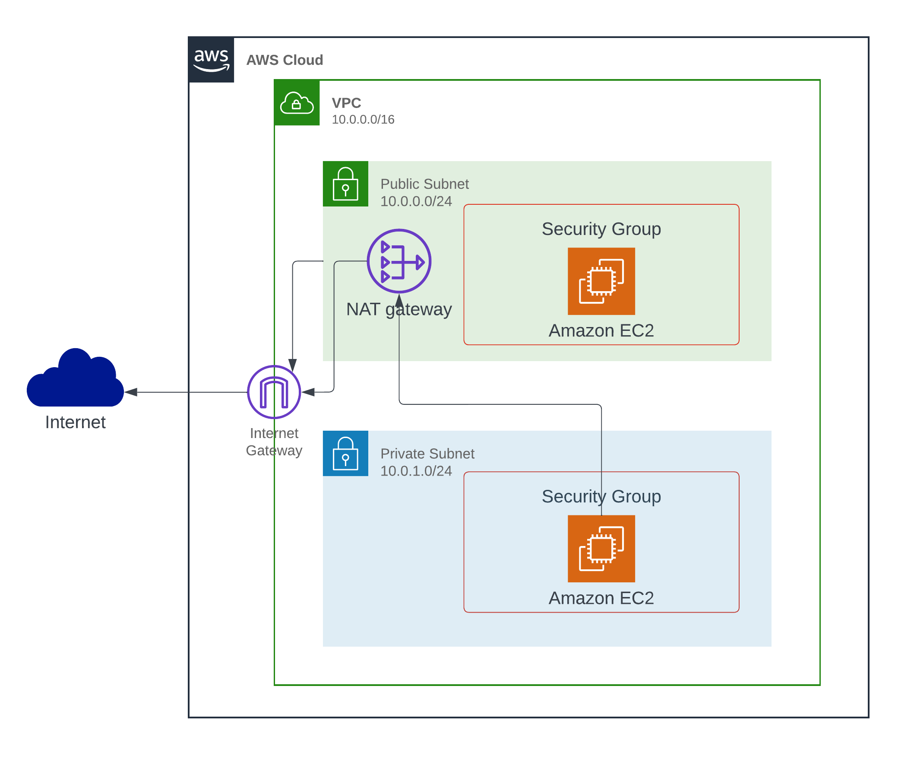

# Terraform Project - AWS VPC, Subnets, and EC2 Instances

This Terraform project creates an AWS VPC with two subnets, one private and one public. It also provisions two EC2 instances, one in each subnet. The public subnet allows HTTP and SSH traffic, while the private subnet does not have direct internet access.

## Project Structure



## Prerequisites

Before running this Terraform project, make sure you have the following prerequisites set up:

1. AWS account credentials with appropriate permissions to create resources.
2. Terraform installed on your machine. You can download Terraform from the official website: Terraform Downloads.
3. Configure AWS credentials on your local machine or provide them as environment variables.

## Usage

Follow these steps to deploy the infrastructure using Terraform:

1. Clone the repository:

    ```bash
     git clone https://github.com/alytaha46/terraform.git
    ```

2. Change into the project directory:

    ```bash
     cd terraform
    ```

3. Initialize the Terraform project:

    ```bash
     terraform init
    ```

4. Review and customize the variables in variables.tf file as per your requirements.

5. (Optional) Modify the main.tf file to add any additional resources or configurations.

6. Plan the infrastructure deployment:

    ```bash
     terraform plan
    ```
    This command will display the execution plan and show the resources that Terraform will create.

7. Deploy the infrastructure:

    ```bash
     terraform apply
    ```

    Confirm the deployment by typing yes when prompted.

8. Wait for Terraform to provision the resources. It may take a few minutes.

9. Once the deployment is complete, the output variables will be displayed, including the public IP and private IP of the created EC2 instances.

10. To destroy the infrastructure and remove all resources:

    ```bash
     terraform destroy
    ```

    Confirm the destruction by typing yes when prompted.

## Outputs

The Terraform project provides the following output variables:

* public_ec2_ip: Public IP address of the EC2 instance in the public subnet.
* private_ec2_ip: Private IP address of the EC2 instance in the private subnet.

These output variables can be accessed after running the terraform apply command.

## Customization

Feel free to customize the project as needed. You can modify the variables.tf file to change the VPC and subnet configurations, or update the main.tf file to add additional resources or configurations.

## Contributing

Contributions are welcome! If you find any issues or have suggestions, please open an issue or submit a pull request in the GitHub repository.
